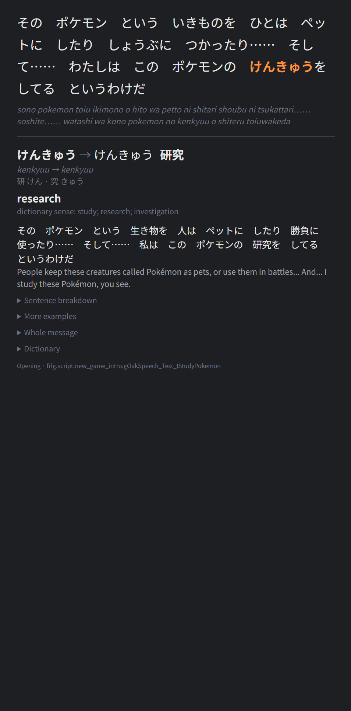
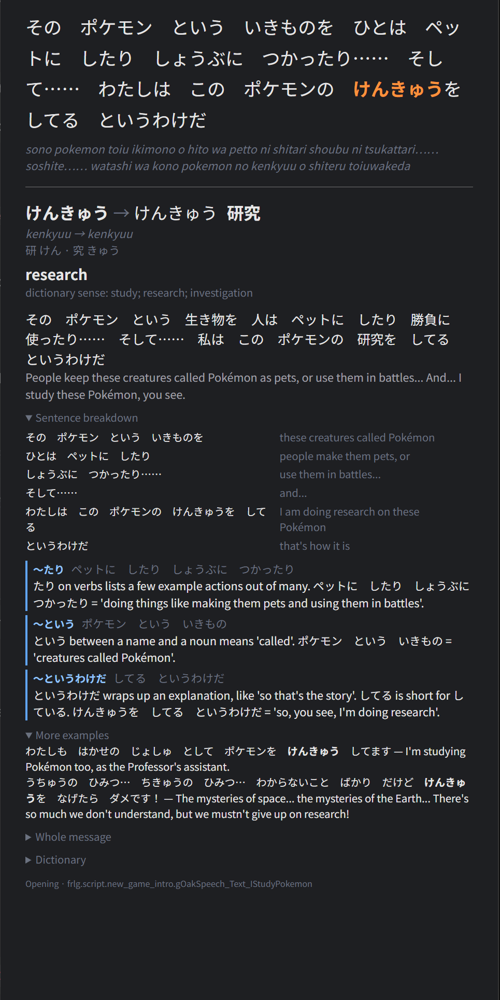

# pokemon-firered-jp-anki

An Anki deck made from the Japanese text of Pokémon FireRed (GBA): one card
for every form of every word, in the order you meet them when you play, each
shown in the sentence where it first appears.

The game is written almost entirely in kana, so the same spelling can be several
words (かみ is 紙, 神 or 髪). A tokenizer and a dictionary alone pick wrong, so
every sentence is analysed by Claude with its neighbours, speaker and location in
view, and JMdict is used to ground and check the answer.

- **Use the deck:** download `firered_jp.apkg` from the
  [latest release](https://github.com/mkusm/pokemon-firered-jp-anki/releases/latest)
  and read [How to use](#how-to-use).
- **How it is made:** [`docs/how-it-works.html`](docs/how-it-works.html)
  (open it in a browser), and [Building it yourself](#building-it-yourself).

## What you get

One package, `firered_jp.apkg`, with 11,080 cards in three decks:

| Deck | Cards | What it is |
|---|---|---|
| **1 Story** | 9,533 | The game from the title screen through the postgame, in the order you meet the text. |
| **2 Help** | 941 | The Help menu you open with L or R, in the menu's own order: each question, then its answer. It stands on its own, with a card for every word the menu uses, so you can read it at any point. About 700 of its words have a card in the story too. |
| **3 Link play / multiplayer** | 606 | What needs a second player or device: the Union Room, trading, Mystery Gift, mail and the word lists you write messages from. Only what the story has not taught. |

### The cards

<p align="center">
  
  
</p>

- **Front:** the sentence as the game shows it, in kana, with one word
  highlighted. Above it, who is speaking when that is known: named by the line
  (オーキド), or read from the map ("old man", タケシ). Below it, what each ＊
  stands for where the game's code says ("the Pokémon making the move").
- **Back:** the word's form and dictionary form, kanji with per-character
  readings, romaji, what it means here, its literal meaning where that adds
  something (ふとっぱら "big belly" for "generous"), the dictionary sense that
  was chosen, how the form is built (`つかまえ (stem) + て (te-form)`), the
  sentence in kanji and in English, up to two more example sentences, the whole
  message, and the JMdict senses.
- **Grammar:** the patterns the word takes part in, each explained in plain
  words for that sentence, and a breakdown of the sentence phrase by phrase.
  The card for と in しゅじんこうと　なって says: "と before なる shows what
  someone turns into; it is a more formal に. しゅじんこうと　なって = 'becoming
  the hero'." A line of one word (はい, a menu word) and a bare name get no
  grammar: there is nothing between words to explain.
- **Notes:** 438 sentences carry a note where a reader outside Japan would
  miss something: a cultural reference (the film on the TV in your room), a
  play on words, a regional dialect, or a place where the English game says
  something else (the old man in Viridian is drunk in Japanese and wants coffee
  in English). Notes that state a fact about the outside world are checked by a
  web search before they are shown.

Every form is drilled where the story first uses it: つかまえた, つかまえて and
つかまえられる are three cards. A particle gets a card for each job it does: か
has one as the question marker and another for "or", が one as the subject
marker and another for "but".

### Names

Names are in English as the English game has them, on the cards and in every
translation: ニビシティ is Pewter City, ふしぎなアメ the Rare Candy, チャンピオンロード
Victory Road, マサキ Bill, グレーバッジ the Boulder Badge. Names FireRed had to
squeeze into twelve letters are spelled the way the series spells them now
(Paralyze Heal, not PARLYZ HEAL). The player and the rival keep the names the
deck fills in for them, Red and Green.

Everything with a name worth knowing has one card, 953 in all: 221 Pokémon,
153 items, 284 moves, 76 abilities, the 17 types, 132 places, the main
characters, the badges, 22 game terms (ポケモンずかん, してんのう) and 15 names from
the real world (ファミコン, きょうと). The card sits at the first line of dialogue
that says the name, or else where the thing is first met:

- a Pokémon in a trainer's team comes right after that trainer's challenge,
  followed by its type, the moves it shows there and its ability (Brock's
  イシツブテ, じめん, まるくなる, がんじょう, then イワーク, しめつける, がんせきふうじ,
  before his defeat line);
- wild Pokémon are spread along their route, each with its type, moves and
  ability;
- a place comes as you walk in; an item where you can first get it.

The card gives the English name and, where the Japanese name is made of words,
what they mean: げんきのかけら is the Revive, "vigor + shard". A type says it is
one: ほのお is "Fire (Pokémon type)". Where a name needs knowledge a learner may
not have, the card explains it: ファミコン is "short for ファミリーコンピュータ (Family
Computer), the console sold outside Japan as the NES".

Names not worth a card get none: the presets of the naming screen, characters
who appear once, pieces of longer names.

### Tags

| Tag | Cards |
|---|---|
| a place (`Route_1`, `Pewter_City_Gym`, `Battle_messages`) | every card: where its sentence is |
| `proper`, with `pokemon`, `item`, `move`, `ability`, `type`, `place`, `person`, `badge`, `term` or `world` | the name cards |
| `fragment` | pieces of broken speech: stammers (こっ　こんなに), garbled or interrupted words. Kept on purpose: the card explains text that would otherwise be puzzling |
| `onomatopoeia` | sound and mimetic words (ドキドキ, キラキラ) |
| `low-confidence` | the dictionary entry could not be confirmed, or the word is a scrap of text the analysis had to guess at |
| `sense-guessed` | the dictionary entry is right but none of its listed senses was confirmed for this sentence |
| `player-boy`, `player-girl` | the 18 words only one side ever meets (ぼっちゃん, じょうちゃん, ウェイトレス…): the game says some lines only to a boy and others only to a girl. A word that also comes up in a line everyone sees is not tagged |
| `word-list` | the bare words of the Link play deck's word lists |

## How to use

All you need is [Anki](https://apps.ankiweb.net/), on desktop or on your phone.

1. **Get the deck.** Download `firered_jp.apkg` from the
   [latest release](https://github.com/mkusm/pokemon-firered-jp-anki/releases/latest)
   and open it in Anki (desktop: File → Import; AnkiDroid and AnkiMobile: open
   the file). It arrives as **Pokemon FireRed Japanese** with the three decks
   inside. Study the story; the other two are there if you want them.
2. **Keep the story order.** New cards must come in the order they were added.
   In the deck's options, under New Cards, set **Insertion order** to
   *Sequential (oldest cards first)*, and leave the display order on its
   defaults. With a random order the deck loses its point.
3. **Pick a pace.** The cards follow the game, so the natural way to use the
   deck is to study a stretch and then play it. For scale: the opening sequence
   is the first 172 cards, everything up to the first gym about 2,400, the whole
   story 9,533. At 20 new cards a day that is about four months to Brock.
4. **Read the card.** Read the sentence on the front and recall the
   highlighted word; the back tells you whether you had it.
5. **Trim what you don't want.** In the browser, search by tag and suspend:
   `tag:fragment`, `tag:onomatopoeia`, `tag:low-confidence`, the side you do not
   play (`tag:player-boy` or `tag:player-girl`), or a place such as
   `tag:Pewter_City_Gym`. To drop words for good, add them to `known.txt` and
   rebuild.

## How the order is decided

1. **Dialogue** follows `map_order.yaml`. A line a script shows only once
   something has happened goes after the scene that makes it happen: the
   Silph Co. employees thank you only after Giovanni is beaten, the old man
   in Viridian gives his catching lesson only once Oak has his parcel. And
   what can be read before the game stops you comes before it does: where a
   scene blocks the way (the rival on the bridge out of Cerulean), the
   people, signs and houses still within reach are read first. Inside a map the lines
   go in the order you walk past the people and signs that say them, measured
   over walkable tiles from the door or edge the story enters by: on Nugget
   Bridge the five trainers come first and the prize last. A line
   that waits for something the same map sets comes after the line shown as
   it happens: the clerk on Route 1 says "come and see us" after handing you
   the Potion.
2. **Everything else** goes where you first see it. Species, moves, items,
   abilities, map names and battle messages are worked out from the decomp: wild
   encounters, trainer parties, Mart stock, item pickups, TMs, and which move
   effect's battle script prints which message. Menus and other UI go by the
   rules in `first_seen.yaml`.
3. **Spreading.** The game is cut into chapters, one per gym badge. Non-dialogue
   lines are interleaved with the story inside their chapter, and only kept if
   they teach something the chapter's dialogue does not. The line that names a
   Pokémon, an item, a move, an ability or a place is not spread: it stays
   where the thing is first met, unless dialogue has already said the name.
   Spread lines land only between messages, never between two sentences of
   one, and no more than two in a row. What is first seen at a chapter's last
   map runs on into the next chapter instead of piling up at the end.
   Inside a map, a trainer's Pokémon, its moves and its ability hang on that
   trainer's challenge; wild ones are spread between the map's messages.
4. **Walks.** Where the game gives you one thing to do at a time,
   `map_order.yaml` lists the lines one by one, whatever kind of text they
   are. The deck opens with the title, the controls guide and Oak's speech,
   then walks through your house: the start menu's entries, each with its
   description, the SELECT button, the bookshelf, everything the bedroom PC
   lets you do with its one Potion, the poster, the TV, Mom and the kitchen,
   and then through Pallet Town from your door to the lab, into the
   rival's house and into the lab while Oak is still out: only then does he
   stop you in the grass.
   Each screen comes as a walk where you first use it: the party screen
   when you get your Pokémon, the options just before the first battle, which
   is a walk too (the challenge, Oak's commentary, the action menu, the
   messages every battle has), saving after the sign in Oak's lab explains it,
   the bag on Route 1, the Mart's counter in Viridian, the Pokédex when Oak
   hands it over. Other menu text floats as
   in step 3, and only once you have left Oak's lab with your first Pokémon.

A sentence often teaches several words. Their cards come in the order the
words stand in the sentence, left to right, so a particle follows the word it
attaches to.

The Help menu and link play are not part of the story and have decks of their
own. Link play is everything that needs a second player or device: the Union
Room, the Cable Club, trading, Mystery Gift, the e-Reader, mail, and the word
lists messages are written from. Save failures and other error messages are
left out.

Text FireRed never shows is left out altogether, and no model stage ever sees
it: Ruby and Sapphire data that no FireRed player meets (Hoenn Pokédex text,
items that cannot be obtained, moves nothing knows), text the decomp marks
as unused, such as an e-mail from the Ruby/Sapphire rival's computer, and text
the English game left in Japanese. The translators skipped what no script
shows, so a line whose English copy is still Japanese is a leftover: a copy of
Hoenn's Safari Zone script, berry tags, the rival's lines for battles you
cannot lose and carry on. A few lines that none of these tests can tell are
listed by hand in `first_seen.yaml`, each checked against the decomp: the TV
looked at from its side, which cannot be reached, a rain message only Ruby and
Sapphire use, the line for two wild Pokémon at once, the Pokédex entry of
Pokémon 0, and the text of Ruby and Sapphire features FireRed has no code
for (the old men of Mauville, trendy sayings, contests, secret bases). The
order stage lists what it left out, and why, in `data/never_shown.csv`.

## Building it yourself

You don't need any of this to use the deck: the release files and Anki are
enough. This part is for rebuilding the deck or changing how it is made.

### Requirements

- [uv](https://docs.astral.sh/uv/) and Python 3.10+
- git
- For the LLM stages only: the `claude` CLI (Claude Code), logged in. They run
  on a Claude subscription through `claude -p`. With the caches in this repo you
  do not need it to rebuild the deck.

### Build the deck

```sh
scripts/fetch_vendor.sh          # the game text and the decomp, into vendor/
uv sync

uv run python -m firered_anki.extract    # corpus → cleaned sentences
uv run python -m firered_anki.order      # story order
uv run python -m firered_anki.tokenize   # tokens and dictionary candidates
uv run python -m firered_anki.cards      # one card per word form and sense
uv run python -m firered_anki.build      # → firered_jp.apkg
uv run python -m firered_anki.check      # checks on what was built; calls no model
```

That takes about two minutes and makes no LLM calls: every answer is read from
`data/cache/`.

The LLM stages only do work when something is missing from the cache, for
example after you change a rule that brings in new text:

```sh
uv run python -m firered_anki.classify          # place strings no rule fits
uv run python -m firered_anki.order             # apply those placements
uv run python -m firered_anki.analyse full      # analyse uncached sentences
uv run python -m firered_anki.analyse escalate  # redo flagged ones on Opus
uv run python -m firered_anki.analyse rerun 0    # redo a chapter on Opus with the current prompt (no number: all)
uv run python -m firered_anki.sense_pick        # check entries found by lookup, choose their sense
uv run python -m firered_anki.splits --chapter 0        # settle strings cut two ways or at a space inside a word, redo the sentences that differ
uv run python -m firered_anki.names --chapter 0         # redo sentences whose translation misnames a Pokémon, item, move, ability, place, person or badge
uv run python -m firered_anki.particles --chapter 0     # particle uses the analysis left without a sense
uv run python -m firered_anki.grammar run --chapter 0   # grammar patterns and sentence breakdowns
uv run python -m firered_anki.notes --chapter 0         # notes on cultural references, wordplay, dialect; facts checked by web search
```

For a whole chapter there is one command that runs the last seven in the right
order and repeats until nothing is left to ask:

```sh
uv run python -m firered_anki.chapter 1 --dry-run   # what the chapter still needs
uv run python -m firered_anki.chapter 1             # do it, then build
```

All of them resume from the cache, and `analyse` waits out a usage limit and
carries on. For scale: redoing the first chapter on Opus is about 1,200
sentences in 31 calls, twenty at a time, 10 minutes; its grammar pass is 40
sentences a call, eight at a time, 5 minutes.

### Things you edit

| File | What it controls |
|---|---|
| `known.txt` | Words you already know. They are analysed but never carded. |
| `name_spellings.yaml` | English names FireRed squeezed into twelve letters, with today's spelling (PARLYZ HEAL → Paralyze Heal). |
| `names_by_hand.yaml` | English names of the things the game has no list of, 93 in all: people, Team Rocket, badges, places, game terms and real-world names, some with a note for the card. A game term that is an ordinary word (レポート, the game's word for saving) is marked `plain`, so that it is the term wherever it stands. |
| `map_order.yaml` | Play order of the maps and scenes, following Bulbapedia's walkthrough. Lists single labels where a map is revisited later in the story, and walks: the lines of a screen or a room one by one, in the order you meet them. |
| `hand_lines.yaml` | Text the game draws as a picture, which the text dump lacks. One line: the title screen's ポケットモンスター. |
| `first_seen.yaml` | Where menus, battle text, items and other non-dialogue text is first seen: rules per text group, and the list of story points the LLM may choose from. |
| `first_seen_llm.yaml` | Written by `classify`: the story point chosen for each string no rule fits. Readable, so you can review it. |
| `splits.yaml` | Fixed word boundaries, one decision per string (ポケモンセンター is one word, たいせつな is たいせつ + な), each with its reason. Written by the `splits` stage from two independent model decisions that agreed; you can edit a line by hand, and the stage never changes a string that is already there. |
| `corrections.yaml` | Hand corrections to the model's answers: a translation, a word's gloss, a breakdown line, a grammar explanation. They are laid over the cache when it is read, so running the model again never overwrites them. If the model's answer changes so that a correction no longer fits, `cards` stops and says so. |

After editing any of them, re-run from `order` onward (`corrections.yaml` and
`known.txt` only need `cards` and `build`).

### Layout

```
src/firered_anki/
  extract.py      corpus → sentences
  map_order.py    resolve a message to a map_order entry; coverage check
  decomp.py       read the pret decomp
  order.py        first-seen placement and the global order
  walking.py      the order you walk past a map's people and signs
  blockers.py     what can be read before a scene that stops you
  reach.py        report: lines shown while their speaker cannot be reached
  classify.py     LLM placement of catch-all strings
  spread.py       interleave non-dialogue lines by chapter
  lemmas.py       rough lemmas for the order stage's previews
  tokenize.py     fugashi tokens, JMdict candidates
  models.py       which model answers for which sentence
  analyse.py      per-sentence LLM analysis, dry run, escalation, Opus rerun
  claude_cli.py   headless `claude -p` with a JSON schema
  grounding.py    fill and check JMdict IDs after the LLM
  corrections.py  lay the hand corrections over the LLM's answers
  sense_pick.py   LLM check of entries found by lookup, and their sense
  particles.py    LLM pass: the dictionary sense of each use of a particle
  splits.py       LLM pass: one fixed word boundary per string
  names.py        the names and their cards; the English game's names
  grammar.py      LLM pass for grammar patterns and sentence breakdowns
  notes.py        LLM pass for notes on a sentence; facts checked by web search
  chapter.py      runs the LLM stages for one chapter until nothing is left
  spans.py        where a word is in its sentence
  cards.py        occurrences → cards, sense merge, examples
  kanji_line.py   the game's spaces put back into a card's kanji line
  speakers.py     who says a line, read from the map's people and scripts
  placeholders.py what each ＊ in a sentence stands for
  romaji.py       kana → Hepburn
  build.py        cards → .apkg
  check.py        checks on the built deck
data/cache/       the LLM's answers (tracked)
data/…            stage outputs (ignored; rebuilt)
vendor/           upstream clones (ignored)
```

## Known limits

- Two models made the deck. The story and the Help deck are Opus's work:
  analysis, grammar and notes. The Link play deck (606 cards) is Sonnet's,
  which costs less and is less sure: on a sample of 100 sentences Opus
  corrected a clear Sonnet error in 3 (a wrong item name, a line read as "I
  was asked a favor" that means "do me a favor", and あったら filed under ある
  where it is 合う), and 40 of that deck's cards are tagged `low-confidence`.
  A sentence the story or the Help deck also shows is always Opus's.
- A grammar pattern's name is written per sentence, so the same pattern can be
  spelled two ways on different cards (〜せる and 〜させる).
- A wild Pokémon is spread along its route by rule, not by where its grass
  is, and a move is placed with the first Pokémon that could show it, whether
  or not it uses it.
- A map's dialogue is all placed at the map's first visit, so a name first
  said on a later visit (１のしま in Oak's lab) gets its card early.
- A Pokémon or an item is placed with the map where it is first met or found,
  at that map's first visit, even where it is in a part of the map reached
  only later.
- About 250 battle messages and 580 other UI strings are placed by the LLM's
  judgement, not computed. See `first_seen_llm.yaml`.
- The first chapter, up to Brock, is the largest, about 2,400 cards: that is
  where the menus and most basic vocabulary first appear.
- A speaker is read from the map only where one kind of person can say the
  line; scenes with several people, signs and narration show none. What a ＊
  stands for is given on 171 of the 299 sentences that have one: the rest
  are filled in by screens whose code is not read.
- JMdict comes from `jamdict-data` (a 2020 snapshot).
- Rematch lines of ordinary trainers sit at their route's first visit.

## Sources

- Text: [abcboy101/poke-corpus](https://github.com/abcboy101/poke-corpus)
- Game data: [pret/pokefirered](https://github.com/pret/pokefirered)
- Dictionary: JMdict, via [jamdict](https://github.com/neocl/jamdict)
- Route: [Bulbapedia's FireRed and LeafGreen walkthrough](https://bulbapedia.bulbagarden.net/wiki/Walkthrough:Pok%C3%A9mon_FireRed_and_LeafGreen)
